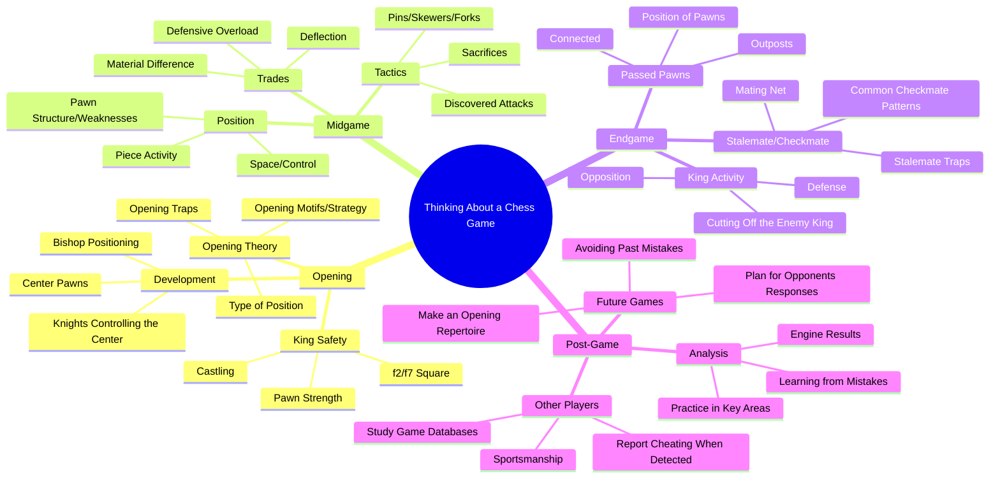

# Thinking About a Chess Game Diagram

## Explanation:  
This is a map representing the thinking process for playing a chess game. The stages of a chess game are the entities of this mindmap. They have a **sequential** relationship with one another, where the opening affects the play of the middlegame, which affects the play of the endgame, which affects the results of the game entirely.
This sequential relationship helps sequence the line of reasoning for a specific move in a chess game.

Take for example this game:
>1. e4 e5
>2. Nf3 Nc6
>3. Bc4 Nd4
>4. Nxe5 Qg5
>5. Nxf7 Qxg2
>6. Rf1 Qxe4+
>7. Be2 Nf3#

This map shows that in a Fried Liver-style opening, Black's queen is very powerful, attacking many things and making counterthreats. White goes for a fork, but misses that their kingside rook is under attack, and when it moved, it locked the White king in the center. Because of this lack of space, Black delivered a smotehred checkmate with Nf3#.
